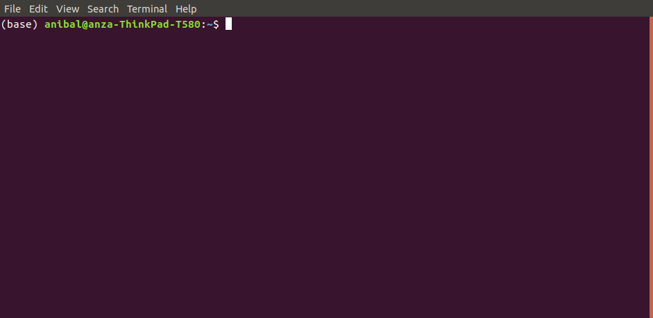
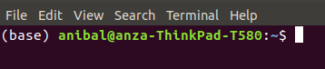

.. pbgl-qtl-bsa documentation master file, created by
   sphinx-quickstart on Tue Jun 15 11:07:04 2021.
   You can adapt this file completely to your liking, but it should at least
   contain the root `toctree` directive.

PBGL QTL-BSA Analysis
=====================

Background
----------

Quantitative trai locus - bulk segregant analysis (QTL-BSA) using allele frequencies, bcftools, Python, Jupyter Notebooks, Miniconda3, Mamba, and Git.

All the commands run in a Linux terminal are preceded by the `$` prompt sign. To run a command, copy/past the command without the `$` sign. Those commands run in a Jupyter Notebook are preceded by the `In [ ]:` 

.. note::
   This is not an official IAEA publication but is made available as working material. The material has not undergone an official review by the IAEA. The views expressed do not necessarily reflect those of the International Atomic Energy Agency or its Member States and remain the responsibility of the contributors. The use of particular designations of countries or territories does not imply any judgement by the publisher, the IAEA, as to the legal status of such countries or territories, of their authorities and institutions or of the delimitation of their boundaries. The mention of names of specific companies or products (whether or not indicated as registered) does not imply any intention to infringe proprietary rights, nor should it be construed as an endorsement or recommendation on the part of the IAEA.
   
Installations - Virtual Environments and Software Packages
----------------------------------------------------------

Before installing any necessary software, it is recommended to check if the computer is running 32-bit or 64-bit for downloading Miniconda3. Run the following to verify the system:

::

   $ uname -m

Miniconda3 (conda) and Mamba
^^^^^^^^^^^^^^^^^^^^^^^^^^^^

Download the Miniconda3, or simply "conda", installer:
 
 - `Miniconda3 installer for Linux <https://docs.conda.io/en/latest/miniconda.html#linux-installers>`_

Run the downloaded installer (for a 64-bit system):

::

   $ bash Miniconda3-latest-Linux-x86_64.sh
   
Open a new terminal window for conda to take effect. The word `(base)` should appear in front of the computer name in the terminal window, like so:

   

Verify the installation and update conda in new terminal window with:

::

   $ conda env list
   $ conda update --all
   $ conda upgrade --all
   
Install mamba library/package manager that will be used for installing software dependencies of the tool:

::

   $ conda install mamba --yes
   
Git Installation and Repo Cloning
^^^^^^^^^^^^^^^^^^^^^^^^^^^^^^^^^

Git is required for cloning locally (downloading a copy to your local computer) the PBGL QTL-BSA Github repository. Git and Github are used for version control of software. It keeps track of development, releases, and issues of a software project.

Install **git** for cloning the **pbgl-qtl-bsa** software repository from Github, where the latetest version of the tool resides:

::

   $ mamba install git --yes
   
After the instalation, clone PBGL's QTL-BSA repository, **pbgl-qtl-bsa**, to the local computer in any desired directory.

::

   $ git clone https://github.com/pbgl/pbgl-qtl-bsa.git
   
The cloning process will depict the following:

::

   Cloning into 'pbgl-qtl-bsa'...
   remote: Enumerating objects: 139, done.
   remote: Counting objects: 100% (139/139), done.
   remote: Compressing objects: 100% (116/116), done.
   remote: Total 139 (delta 21), reused 129 (delta 16), pack-reused 0
   Receiving objects: 100% (139/139), 6.90 MiB | 298.00 KiB/s, done.
   Resolving deltas: 100% (21/21), done.

The **pbgl-qtl-bsa** repository should have been cloned successfully. Verify that the download is complete by listing the folders/files in the directory.

::

   $ ls -l
   
The folder called **pbgl-qtl-bsa** should be listed in the directory.

Required Libraries with Mamba
^^^^^^^^^^^^^^^^^^^^^^^^^^^^^

QTL-BSA has multiple dependencies, listed below:

- Bcftools
- Python

  - pandas
  - matplotlib
  - scikit-allel
  - seaborn
  - natsort

- Jupyter Notebook

There are two ways to create the **qtl-bsa** virtual environment and install the necessary libraries to run QTL-BSA: automatically or manually.

Automatically (faster)
~~~~~~~~~~~~~~~~~~~~~~

One YAML file, **environment.yml**, is provided to automatically create a virtual environment and install the dependent libraries through mamba. The file creates the **qtl-bsa** virtual environment, along Jupyter Notebook, and the Python libraries. Run the **environment.yml**:

::

   $ mamba env create --file envs/environment.yml
   
Once done, a list of the virtual environments available can be seen by running:

::

   $ conda env list
   
Activate (enter) the recently-created virtual environment **qtl-bsa**:

::

   $ conda activate qtl-bsa
   
Once done, the virtual environment should be activated and all the necessary packages should be installed. This can be verified with:

::

   $ conda list

Manually (slower)
~~~~~~~~~~~~~~~~~

To manually create and activate an environment, run:

::

   $ conda create --name qtl-bsa
   $ conda activate qtl-bsa 
   
Start running the installations of the necessary libraries:

::

   $ mamba install python=3.6.7 notebook natsort bcftools pandas matplotlib seaborn scikit-allel --yes
   
Once done, all the necessary packages should be installed. This can be verified with:

::

   $ conda list
   
Running Jupyter
---------------

To activate Jupyter, run the following in the terminal:

::

   $ jupyter notebook
   
This command will start a Jupyter session inside the directory the command is run. The user can navigate between directories, visualize files, and edit files in a web browser by clicking on directories or files, respectively.  

Look for the directory **pbgl-qtl-bsa** and click on it. Click on **tool** directory, which contains three directories and two Jupyter Notebooks. Here is a breakdown of each:

- `Allele_Frequency_Plots_Computomics`:

  - directory that will contain both tab-files and images output after running a QTL-BSA analysis

- `config`:
  
  - directory containing configuration files specifying file paths, parameter definitions, list of samples, and list of chromosomes

- `scripts`:

  - directory containing Python scripts with functions for plotting allele frequencies
    
- two Jupyter Notebooks:

  - QTL-BSA-sorghum-example.ipynb
  
    - example analysis of a comparison between a control and mutant of sorghum 
    
  - QTL-BSA.ipynb
    
    - template for the user
    
.. note::
   Jupyter lets the user duplicate, rename, move, download, view, or edit files in a web browser. This can be done by clicking the box next to a file and choosing accordingly. 
   
Editing the Configuration File
^^^^^^^^^^^^^^^^^^^^^^^^^^^^^^

In order to run the QTL-BSA Jupyter Notebook, the user needs to feed it with a configuration file (**config-allele-freq.yml**) that specifies the path to the vcf file, list of samples, chromosomes to analyze, and window/step size definitions for calculating and plotting allele frequencies.

The configuration file **config-allele-freq.yml** can be found in the **pbgl-qtl-bsa/tool/config** directory. The configuration file contains the following fields:

::

   # VCF File information (unzipped .vcf)
   vcf_file:
     path: 
     name: 
     extension: 

   # parameters to plot allele frequencies
   window_size: 
   step_size: 

   # list of samples
   samples:
     control: 
     mutant: 
     F2_wild_type: 
     F2_mutant: 

   # chromosomes to analyze
   chromosomes:
     - 

.. note::
   The user needs to edit **config-allele-freq.yml** to point towards a vcf file; specify chromosomes to analyze; and define the parameters to plot allele frequencies. The paths specified in this tutorial manual may not match the paths of the user's computer.
   
One example configuration files is provided (**config-allele-freq-sorghum-example.yml**). The configuration file **config-allele-freq.yml** contains multiple fields to be defined by the user.

- `vcf_file`:

  - `path` - path to directory containing the vcf file
  - `name` - name of the vcf file
  - `extension` - type of file; only handles **.vcf** files at the moment
  
- `window_size` - integer specifying the window size to allele frequencies
- `step_size` - integer specifying the step size of the sliding window
- `samples`:

  - `control` - control parent
  - `mutant` - mutant parent
  - `F2_wild_type` - F2 organism showing wild type phenotype
  - `F2_mutant` - F2 organism showing mutant phenotype

- `chromosomes` - list of chromosomes to analyze

Running a RCNV_seq-template Jupyter Notebook
^^^^^^^^^^^^^^^^^^^^^^^^^^^^^^^^^^^^^^^^^^^^

.. note::
   It is recommended to duplicate the **QTL-BSA.ipynb** notebook and then renaming the copy before doing any edits to the notebook.
   
In the **pbgl-qtl-bsa/tool** directory, click on **QTL-BSA.ipynb** and a new tab in your web-browser will open the notebook.

The notebook contains cells that are populated by text or code. Instructions are provided in the notebook to guide the user. To run a cell, click on the corresponding cell and click on the `Run` button on the top of the notebook. Another way to run a cell can be done by clicking on the corresponding cell and pressing **Ctrl + Enter** or **Shift + Enter**.

The notebook consists of 3 sections:

1. Import Necessary Libraries and Functions
2. Configuration File Path Definition
3. Plot Allele Frequencies

The third section **Plot Allele Frequencies** has 3 subsections:

1. Unweighted Window Sizes
2. Weighted Window Sizes from Configuration File
3. Weighted Window Sizes Defined in Jupyter Notebook

Import Necessary Libraries and Functions
~~~~~~~~~~~~~~~~~~~~~~~~~~~~~~~~~~~~~~~~

Imports the functions needed to plot the allele frequencies. All the libraries are imported from **pbgl-qtl-bsa/tool/scripts** directory.

::

   In [ ]: from scripts.plot_allele_freqs import *
   
Configuration File Path Definition
~~~~~~~~~~~~~~~~~~~~~~~~~~~~~~~~~~

Defines the path and name of the configuration path. Configuration files can be found in the **pbgl-qtl-bsa/tool/config** directory.

::

   In [ ]: config = "config/config-allele-freq.yml"
   
Plot Allele Frequencies
~~~~~~~~~~~~~~~~~~~~~~~

Contains three functions to plot the allele frequencies by extracting information from the configuration file defined previously. These are:

1. Plotting Unweighted Window Sizes
 
::

   In [ ]: plot_allele_frequencies_raw(config)
   
This function will plot the allele frequencies of an F2 mutant against the F2 wild-type. It does not take into consideration neither the window size nor the step size. The function has no additional parameters.

2. Plotting Weighted Window Sizes from Configuration File

::

   In [ ]: plot_allele_frequencies_weighted(config)
   
This function will plot the allele frequencies of an F2 mutant against the F2 wild type. It takes into consideration both the window size and step size.

Running the function as shown will use the values defined in `window_size` and `step_size` inside the configuration file used.

3. Plotting Weighted Window Sizes from Jupyter Notebook

::

   In [ ]: plot_allele_frequencies_weighted(config, window_size= , step_size= )
   
This function provides the user to edit the `window_size` and `step_size` parameters in-place in the Jupyter Notebook without having to go back and edit the configuration file. If the parameters `window_size` and `step_size` are empty, the function will extract these parameter values from the configuration file.

Example Tutorial - QTL-BSA Analysis of Sorghum
----------------------------------------------

In this section of the manual, an example analysis of sorghum will be shown in a step-by-step process. The data has been filtered to show variant locations where the control has genotype '0/0' and the mutant has genotype '1/1'. The QTL-BSA analysis will depict an artifact on chromosome Chr04.

The tutorial is divided between the following sections:

1. Data Download
2. General Installations
3. Github Repository Cloning
4. Virtual Environment Creation
5. Configuration File Editing
6. Jupyter Notebook Analysis

Data Download
^^^^^^^^^^^^^

Running this tutorial requires one variant call format (VCF) file of sorghum crop: **freebayes_D2.filtered.vcf**. It is used in genetics for storing variations of gene sequences.

The following links can be used to download the necessary VCF file and its correspondig indexed **.tbi** file:

- freebayes_D2.filtered.vcf

  - https://bss1innov1nafa1poc1.blob.core.windows.net/sample-container/2021_Training/freebayes_D2.filtered.vcf

- freebayes_D2.filtered.vcf.gz.tbi

  - https://bss1innov1nafa1poc1.blob.core.windows.net/sample-container/2021_Training/freebayes_D2.filtered.vcf.gz.tbi
  
There are two additional ways to download the **.vcf** file and its respective index, besides clicking the links above:

1. Linux terminal
2. Web-Browser

Linux Terminal
~~~~~~~~~~~~~~

Open a new terminal and navigate to a directory of choice. We recommend creating a directory to store the data and running `wget` in the respective location:

:: 

   $ mkdir vcf_files
   $ cd vcf_files
   $ wget https://bss1innov1nafa1poc1.blob.core.windows.net/sample-container/2021_Training/freebayes_D2.filtered.vcf
   $ wget https://bss1innov1nafa1poc1.blob.core.windows.net/sample-container/2021_Training/freebayes_D2.filtered.vcf.gz.tbi

Web-Browser
~~~~~~~~~~~

Open a web-browser of preference. Copy/paste the links provided above in the address bar. This should automatically begin the download. Move the downloaded files to a location of personal preference.

General Installations
^^^^^^^^^^^^^^^^^^^^^

Open a web browser and copy/paste the following link to download Miniconda3:

- https://docs.conda.io/en/latest/miniconda.html#linux-installers

After download, open a new terminal window, navigate to the directory with the downloaded Miniconda3 installer, and run the installation.

.. note::
   The donwloaded Miniconda3 installer file might not match the one run in this example. Please, type the corresponding name of the **.sh** file downloaded.

::

   $ bash Miniconda3-latest-Linux-x86_64.sh

Once the Miniconda3 installation is done, close the terminal and open a new one. The word `(base)` should be present to the left of the computer name in the prompt. Update conda and install mamba.

::

   $ conda update --all --yes
   $ conda upgrade --all --yes
   $ conda install mamba --yes

Github Repository Cloning
^^^^^^^^^^^^^^^^^^^^^^^^^

Git or Github is used for storage and version control of software projects. Git is used to manage in a local Linux terminal. First, git will need to be installed. In a new terminal window, run the installation command:

::

   $ mamba install git --yes

After installing git, create a location to store Github repoitories, navigate into it, and clone (download a copy locally) of PBGL's **pbgl-qtl-bsa** repository.

::

   $ mkdir Github
   $ cd Github
   $ git clone https://github.com/pbgl/pbgl-qtl-bsa.git
   
A successful cloning will output the following:

::

   Cloning into 'pbgl-qtl-bsa'...
   remote: Enumerating objects: 139, done.
   remote: Counting objects: 100% (139/139), done.
   remote: Compressing objects: 100% (116/116), done.
   remote: Total 139 (delta 21), reused 129 (delta 16), pack-reused 0
   Receiving objects: 100% (139/139), 6.90 MiB | 298.00 KiB/s, done.
   Resolving deltas: 100% (21/21), done.

Navigate into the cloned repository,

::

   $ cd pbgl-qtl-bsa

Virtual Environment Creation
^^^^^^^^^^^^^^^^^^^^^^^^^^^^

Once inside the **pbgl-qtl-bsa** directory, create the **qtl-bsa** virtual environment, install the necessary libraries, and activate the newly created **qtl-bsa** virtual environment. 

::

   $ mamba env create --file envs/environment.yml
   $ conda activate qtl-bsa

The name `(qtl-bsa)` environment should be reflected to the left of the computer name in the terminal command prompt.

Configuration File Editing
^^^^^^^^^^^^^^^^^^^^^^^^^^

Open a Jupyter session by running,

::

   $ jupyter notebook

Navigate to **pbgl-qtl-bsa/tool/config** and click on **config-allele-freq-sorghum-example.yml**. This will open the configuration file in a new web-browser tab. Copy/paste the following in the configuration file.

.. note::
   The `path` to the vcf file will not match. It needs to be edited accordingly to point towards the location of the vcf file stored locally in the user's computer.
   
::

    vcf_file:
      path: /home/anibal/vcf_files
      name: freebayes_D2.filtered
      extension: vcf

    window_size: 500000
    step_size: 100000

    samples:
      control: con-all
      mutant: D2
      F2_wild_type: D2_F2_TT
      F2_mutant: D2_F2_tt

    chromosomes:
      - Chr01
      - Chr02
      - Chr03
      - Chr04
      - Chr05
      - Chr06
      - Chr07
      - Chr08
      - Chr09
      - Chr10

Save the file and close the tab.

Jupyter Notebook Analysis
^^^^^^^^^^^^^^^^^^^^^^^^^

In the open Jupyter session, navigate to the **pbgl-qtl-bsa/tool** directory and click on the **QTL-BSA.ipynb** Jupyter Notebook. Begin by running the **Import Necessary Libraries and Functions** section. This can be done by clicking on the cell to be run followed by clicking the `Run` button on the top of the Jupyter Notebook. This cell will import the functions defined in the **pbgl-qtl-bsa/tool/scripts**.

::

   In [ ]: from scripts.plot_allele_freqs import *
   
Type the correct name of the configuration file being loaded under the **Configuration File Path Definitions** section. The configuration file **config-allele-freq-sorghum-example.yml** is loaded from the **pbgl-qtl-bsa/tool/config** directory.

::

   In [ ]: config = "config/config-allele-freq-sorghum-example.yml"

Run the **Unweighted Window Sizes** subsection under the **Plot Allele Frequencies** section. This function will plot the allele frequencies without taking into consideration `window_size` and `step_size`; the output plot is named **freebayes_D2.filtered.pdf** stored in **pbgl-qtl-bsa/tool/Allele_Frequency_Plots_Computomics**. 

::

   In [ ]: plot_allele_frequencies_raw(config)

.. figure:: docs/images/allele-freq-raw.png
   :alt: allele-freq-raw
   :align: center
   
   Allele frequency plot with unweighted window and step sizes

This function will also create a tabulated **.tsv** file named **freebayes_D2.filtered.tsv** stored in **pbgl-qtl-bsa/tool/Allele_Frequency_Plots_Computomics**. This file can be exported to any statistical software tool for further analysis. The file contains the following fields:

- `CHROM` - chromosome ID
- `POS` - position in chromosome in base-pair 
- `REF` - reference sequence
- `ALT` - alternate sequence
- `RO` - reference allele observation count
- `AO` - alternate allele observation count
- `GT` - genotype
- `GQ` - Genotype Quality, the Phred-scaled marginal (or unconditional) probability of the called genotype
- `SampleRO` - wild-type allele observation count
- `SampleAO` - mutant allele observation count

   
   Output tabulated file 

All output files are stored in the directory **pbgl-qtl-bsa/tool/Allele_Frequency_Plots_Computomics**.

In order to plot the allele frequencies using the window and step sizes, run the subsection **Weighted Window Sizes from Configuration File**. The parameters `window_size` and `step_size` are extracted from the configuration file. 

::

   In [ ]: plot_allele_frequencies_weighted(config)
   
The plot using `window_size=500000` and `step_size=100000` from the configuration file outputs the following figure:

   
   Allele frequency plot with window_size=500000 and step_size=100000
   
In order to modify the `window_size` and `step_size` parameters in the Jupyter Notebook without the need of remodifying the configuration file, the `plot_allele_frequencies_weighted` function has two parameters that can be defined to create allele frequencies plots with varying window and step sizes. 

Run the **Weighted Window Sizes Defined in Jupyter Notebook** subsection with bigger window and step sizes.

::

   In [ ]: plot_allele_frequencies_weighted(config, window_size=5000000 , step_size=1000000 )
   

   
   Allele frequency plot with window_size=5000000 and step_size=1000000

This last plot using `window_size=5000000` and `step_size=1000000` clearly shows a variant present in Chr04. Knowing where artifacts like this one are located plays a major role in identifying and visualizing variants in an organism. The user can, in turn, use different tools, like the Integrative Genomics Viewer (IGV), for further analysis.

This culminates the tutorial.

References
----------

**GitHub repositories**:

- `pbgl/pbgl-qtl-bsa <https://github.com/pbgl/pbgl-qtl-bsa>`_
- `amora197/pbgl-qtl-bsa <https://github.com/amora197/pbgl-qtl-bsa>`_
- `AnzaGhaffar/QTL-Snakemake-Workflow <https://github.com/AnzaGhaffar/QTL-Snakemake-Workflow>`_
